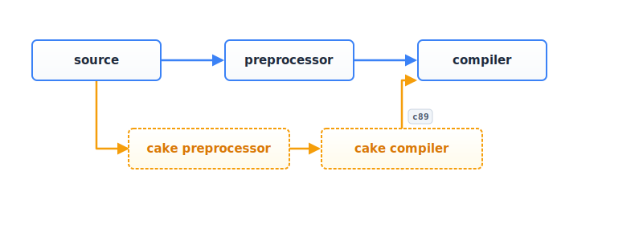
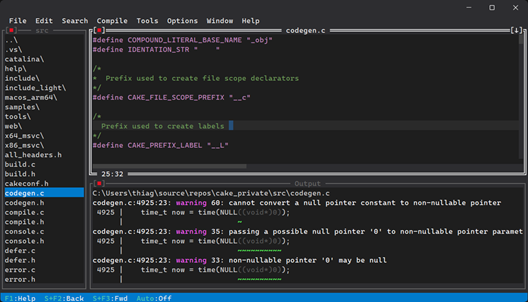

The C Programming language 1978

> _"C is a general-purpose programming language which features economy of expression, modern control flow and data structures, and a rich set of operators. C is not a "very high level" language, nor a "big" one, and is not specialized to any particular area of application. But its absence of restrictions and its generality make it more convenient and effective for many tasks than supposedly more powerful languages."_

> _"In our experience, C has proven to be a pleasant, expressive, and versatile language for a wide variety of programs. It is easy to learn, and it wears well as one's experience with it grows"_

The C Programming language Second Edition 1988

> _"As we said in the preface to the first edition, C "wears well as one's experience with it grows." With a decade more experience, we still feel that way."_


_C is everywhere. From operating systems to embedded devices, from high-performance apps 
to essential technology, C powers the technology we rely on every day. Timeless, 
efficient, and universal._


# About


Cake is a compiler front end written from scratch in C by a human, implementing the C23 language 
specification and beyond.

It serves as a platform for experimenting with new features, 
including C2Y language proposals, safety enhancements, and extensions such as 
literal functions and defer statements.

The current backend generates C89-compatible code, which can be pipelined with existing 
or old compilers to produce executables. 




Cake aims to enhance C's safety by providing high-quality [warning messages](warnings.md) and advanced 
flow analysis, including [object lifetime](ownership.md) checks.


# Web Playground

This is the best way to try.

http://cakecc.org/playground.html

# Use cases

Note: Cake is still in development and has not yet reached 
a stable version.

Cake can be used as a static analyzer alongside other compilers. 
It generates SARIF files, which are recognized by popular IDEs 
such as Visual Studio and Visual Studio Code, providing a 
seamless integration.

It can also function as a preprocessor, converting C23 code to C89. 
This allows developers to use modern or experimental features while targeting 
compilers that do not yet support the latest language standards.

Cake is also a cross-compiler. For example, on Windows it can use Linux 
headers and generate GCC-compatible code for Linux, and vice versa. 
This makes it very useful when developing multiplatform code.

Another use of Cake is as a library to parse source code and build an AST, 
which can then be used for other purposes; for instance, automatic serialization,
automatic documentation and more.

# Features

* C23 preprocessor
* C23 syntax analysis
* C23 semantic analysis
* Static [object lifetime](ownership.md) checks (Extension)
* Sarif output
* Cross compiling
* C89 backend
* Style checker
* AST 
* Lots of [diagnostics](warnings.md)


# Build

GitHub 
https://github.com/thradams/cake

## MSVC build instructions
Open the Developer Command Prompt of Visual Studio. Go to the `src` directory and type

```
cl build.c && build
```

This will build `cake.exe`, then run cake on its own source code.


## GCC on Linux build instructions
Got to the *src* directory and type:

```
gcc build.c -o build && ./build
```

## Clang on Linux/Windows/MacOS build instructions
Got to the *src* directory and type:

```
clang build.c -o build && ./build
```

> Note: Cake currently compiles and runs on macOS. However, Clang's system headers are not yet parsed correctly on macOS, so you may need to provide a few declarations manually while testing.

If you encounter an error such as:
fatal error: X11/Xft/Xft.h: No such file or directory

Ubuntu / Debian:  `sudo apt install libx11-dev libxft-dev`
Fedora: `sudo dnf install libX11-devel libXft-devel`
Arch Linux: `sudo pacman -S libx11 libxft`
openSUSE:`sudo zypper install libX11-devel libXft-devel`

These headers are used by the IDE.

## Running tests

Passing `test` argument on any platform will run a large set of tests.

```
gcc  build.c -o build && ./build test
```

## Emscripten build instructions (web)

Emscripten https://emscripten.org/  is required. 

First do the normal build. 

The normal build also generates a file `lib.c` that is the amalgamated  version of the "core lib".

Then at `./src` dir type:

```
call emcc -sSTACK_SIZE=8388608 -DMOCKFILES -Wno-multichar "lib.c" -o "Web\cakejs.js" -s WASM=0 -s EXPORTED_FUNCTIONS="['_CompileText']" -s EXTRA_EXPORTED_RUNTIME_METHODS="['ccall', 'cwrap']"
```

This will generate the *\src\Web\cake.js*

# Installation (optional)

Installation is optional. Cake can be built and run directly from the `src` 
directory as shown above, without installing anything. Installing simply 
copies the compiler and supporting files into a system directory and updates 
the system `PATH` so the `cake` command can be executed from any terminal.

## Windows

Run the installer as Administrator.

```bash
install.exe
```

The installer:

* Copies Cake files into `Program Files`
* Updates the system `PATH`
* Removes obsolete Cake `PATH` entries from previous installations

## Linux / macOS

Run the installer using:

```bash
sudo ./install
```

The installer:

* Copies Cake files into the installation directory
* Creates or updates a file in `/etc/profile.d/`
* Adds Cake to the system `PATH`

Changes become available in new login sessions.

# Running cake

Samples

```
cake source.c
```

this will output *./platform short name/source.c*

See [Manual](manual.md)


# IDE

The Cake IDE was developed with the help of AI tools. It has now been adopted as part of the Cake project and will be maintained alongside the rest of the codebase. Over time, the IDE code will be reviewed, refined, and gradually humanized as the project evolves.

The IDE works in macOS, Windows and Linux.




# Road map

* function literal and local functions implementation
* Making it usable as C89 backend and fixes
* Flow v2 algorithm was delayed


# Participating

You can contribute by trying out cake, reporting bugs, and giving feedback.

Have a suggestion for C?
  
DISCORD SERVER

[https://discord.gg/YRekr2N65S](https://discord.gg/YRekr2N65S)


# How cake is developed ?

I use Visual Studio 2022 IDE to write and debug the Cake source.
Cake parses itself using the MSVC includes and generates the X\_86\_msvc 
directory after the build.
The Linux version is tested inside WSL, and the macOS version is 
currently the least tested but is expected to work.


# Cake x CFront

CFront was the first C++ compiler, designed to translate C++ source code into C.
Initially compatible with C89, it diverged as the C and C++ languages evolved 
independently.

Cake maintains alignment with the standard specifications and ongoing 
development of C, ensuring full compatibility.

The compiler introduces extensions that preserve the fundamental design 
of C while supporting experimentation and open contributions to the 
language's evolution.


# License
Cake uses the same license of GCC. GPLv3


 
 
  
 


