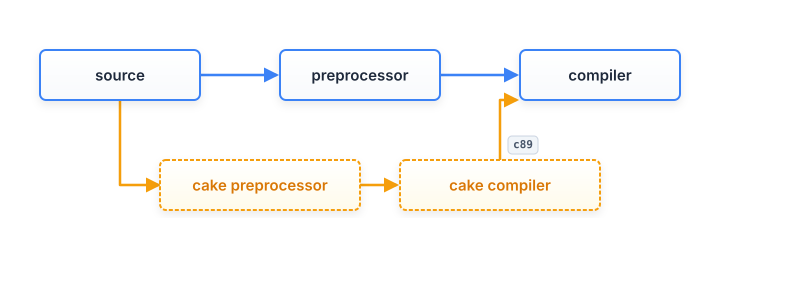
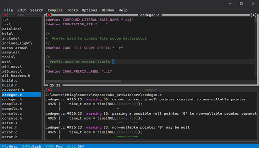

Kernighan & Ritchie, *The C Programming Language*, 1978:

> _"C is a general-purpose programming language which features economy of expression, modern control flow and data structures, and a rich set of operators. C is not a "very high level" language, nor a "big" one, and is not specialized to any particular area of application. But its absence of restrictions and its generality make it more convenient and effective for many tasks than supposedly more powerful languages."_

> _"In our experience, C has proven to be a pleasant, expressive, and versatile language for a wide variety of programs. It is easy to learn, and it wears well as one's experience with it grows"_

Kernighan & Ritchie, *The C Programming Language*, Second Edition, 1988:

> _"As we said in the preface to the first edition, C "wears well as one's experience with it grows." With a decade more experience, we still feel that way."_


_C is everywhere. From operating systems to embedded devices, from
high-performance apps to essential technology, C powers the technology we rely
on every day. Timeless, efficient, and universal._

_The code that AI now writes runs best where it can be read, verified
and trusted. A small language with no hidden machinery. C gives the machine
speed, and the human control and platform independence._


# About


Cake is a compiler front end written from scratch in C by a human, implementing
the C23 language specification and beyond.

It serves as a platform for experimenting with new features, including C2Y
language proposals, safety enhancements, and extensions such as literal
functions and defer statements.

The current backend generates C89-compatible code, which can be pipelined with
existing or old compilers to produce executables.




Cake aims to enhance C's safety by providing high-quality [warning
messages](diagnostics.md) and advanced flow analysis, including [object
lifetime](ownership.md) checks.


# Web Playground

This is the best way to try it.

https://cakecc.org/playground.html

# Use cases

Note: Cake is still in development and has not yet reached a stable version.

Cake can be used as a static analyzer alongside other compilers. It generates
SARIF files, which are recognized by popular IDEs such as Visual Studio and
Visual Studio Code, providing a seamless integration.

It can also function as a preprocessor, converting C23 code to C89. This allows
developers to use modern or experimental features while targeting compilers that
do not yet support the latest language standards.

Cake is also a cross-compiler. For example, on Windows it can use Linux headers
and generate GCC-compatible code for Linux, and vice versa. This makes it very
useful when developing multiplatform code.

Another use of Cake is as a library to parse source code and build an AST, which
can then be used for other purposes; for instance, automatic serialization,
automatic documentation and more.

# Features

* C23 preprocessor
* C23 syntax analysis
* C23 semantic analysis
* Static [object lifetime](ownership.md) checks (Extension)
* SARIF output
* Cross compiling
* C89 backend
* Style checker
* AST 
* Lots of [diagnostics](diagnostics.md)


# Build

GitHub 
https://github.com/thradams/cake

## MSVC build instructions
Open the Developer Command Prompt of Visual Studio. Go to the `src` directory and type

```
cl build.c && build
```

This will build `cake.exe`, then run cake on its own source code.


## GCC on Linux build instructions
Go to the *src* directory and type:

```
gcc build.c -o build && ./build
```

## Clang on Linux/Windows/macOS build instructions
Go to the *src* directory and type:

```
clang build.c -o build && ./build
```

If you encounter an error such as:
fatal error: X11/Xft/Xft.h: No such file or directory

Ubuntu / Debian / Raspberry Pi OS:  `sudo apt install libx11-dev libxft-dev`

Fedora: `sudo dnf install libX11-devel libXft-devel`

Arch Linux: `sudo pacman -S libx11 libxft`

openSUSE:`sudo zypper install libX11-devel libXft-devel`

These headers are used by the IDE.

If you encounter an error such as:
fatal error: wayland-client.h: No such file or directory

Ubuntu / Debian / Raspberry Pi OS: `sudo apt install libwayland-dev libxkbcommon-dev libfreetype-dev libfontconfig-dev`

Fedora: `sudo dnf install wayland-devel libxkbcommon-devel freetype-devel fontconfig-devel`

Arch Linux: `sudo pacman -S wayland libxkbcommon freetype2 fontconfig`

openSUSE: `sudo zypper install wayland-devel libxkbcommon-devel freetype2-devel fontconfig-devel`

These headers are used by the Wayland IDE backend (`./build wayland`, or the
default in a Wayland session when these libraries are installed).

## TCC on Windows/Linux build instructions
With [tcc](https://bellard.org/tcc/) on the PATH, go to the *src* directory and type:

```
tcc build.c -o build && ./build
```

On Windows, `build_tcc.bat` does the same. A Cake built by tcc uses the matching
tcc target (`x86_64-w64-mingw32-tcc`, `x86_64-linux-gnu-tcc` or `aarch64-apple-darwin-tcc`) and the tcc headers by default. Tested with tcc 0.9.28 on Windows
and 0.9.27 on Linux.

## Build options

`build` accepts one optional argument, on any platform:

| Argument | Effect |
|---|---|
| *(none)* | full build: tools, docs, amalgamated `lib.c`, `cake` and the IDE |
| `full` | build everything with `-DTEST`, but do not run the test suite |
| `test` | same as `full`, then run the test suite |
| `debug` | build without optimizations and without `-DNDEBUG` |

For example, to run the tests:

```
gcc build.c -o build && ./build test
```

## Emscripten build instructions (web)

[Emscripten](https://emscripten.org/) is required.

First do the normal build: besides `cake`, it generates `lib.c`, the amalgamated version of the core library, which is what the web build compiles.

Then, in the `src` directory, type:

```
emcc -sSTACK_SIZE=8388608 -DMOCKFILES -Wno-multichar lib.c -o web/cakejs.js -s WASM=0 -s EXPORTED_FUNCTIONS="['_CompileText']" -s EXTRA_EXPORTED_RUNTIME_METHODS="['ccall', 'cwrap']"
```

This generates `src/web/cakejs.js`, used by `src/web/playground.html`.

# Installation (optional)

Installation is optional. Cake can be built and run directly from the `src` 
directory as shown above, without installing anything. Installing simply 
copies the compiler and supporting files into a system directory and updates 
the system `PATH` so the `cake` command can be executed from any terminal.

Download the installer for your system from the
[GitHub releases](https://github.com/thradams/cake/releases); no source code
or compiler is needed.

Versions are installed side by side (`cake/<version>`); the last one
installed is the one in the `PATH`.

## Windows

Run `cake-<version>-setup.exe` (it asks for Administrator).

The setup:

* Copies Cake files into `Program Files\cake\<version>` (the folder can be changed)
* Adds that folder to the system `PATH`, removing other Cake versions from it
* Registers an uninstaller in Settings > Apps

The installer source is `src/tools/win_installer.c`; the installed files are
listed in `src/tools/win_installer.h`.

## Linux / macOS

The release has `cake-<version>-linux-x64.tar.gz`, `cake-<version>-linux-arm64.tar.gz`
(e.g. Raspberry Pi, 64-bit OS) and `cake-<version>-macos.tar.gz`,
compressed archives (like a zip) with the binaries and `install.sh`.

```bash
curl -L https://github.com/thradams/cake/releases/download/v<version>/cake-<version>-linux-x64.tar.gz | tar xz
cd cake-<version>-linux-x64
sudo ./install.sh
```

(use `linux-arm64` on a Raspberry Pi, `macos` on macOS). If the archive was downloaded
with a browser, extract it with `tar xzf cake-<version>-linux-x64.tar.gz`
or with a double click, then run `sudo ./install.sh` inside the folder.

The installer (`src/tools/unix_install.sh`):

* Copies Cake files into `/usr/local/cake/<version>`
  (use `sudo INSTALL_PREFIX=/opt ./install.sh` for another prefix)
* Adds that folder to the `PATH`: `/etc/profile.d/cake.sh` on Linux,
  `/etc/paths.d/cake` on macOS
* Creates `uninstall.sh` in the installation folder

Changes become available in new terminals. To remove:

```bash
sudo /usr/local/cake/<version>/uninstall.sh
```

Notes:

* Linux: built on Ubuntu 22.04 (needs glibc 2.35+). `cakeide` needs the
  X11/Xft libraries (e.g. `sudo apt install libxft2`, also on Raspberry Pi OS).
* Raspberry Pi: `cakeide` is an X11 program. Under a Wayland session (the
  default on Raspberry Pi OS) it runs through XWayland and is very slow.
  Switch to an X11 session: `sudo raspi-config`, then
  Advanced Options > Wayland > X11, and reboot.
* macOS: Apple Silicon (arm64) only. The binaries are not signed; if the
  archive was downloaded with a browser, macOS blocks them. Allow with
  `xattr -dr com.apple.quarantine cake-<version>-macos` before installing
  (not needed when downloaded with `curl`).

# Running cake

```
cake source.c
```

This writes the C89 output to `./<target>/source.c`, where `<target>` is the platform Cake was built for — for example `./aarch64-apple-darwin-clang/source.c` or `./x86_64-pc-windows-msvc/source.c`. `-target=<name>` selects another platform; see the [Manual](manual.md) for the full option list.


# IDE

The Cake IDE was developed with the help of AI tools. It has now been adopted as
part of the Cake project and will be maintained alongside the rest of the
codebase. 

The IDE works in macOS, Windows and Linux / Raspberry Pi.




# Road map

* Making it usable as a C89 backend, and fixes
* Reaching a stable release


# Participating

You can contribute by trying out cake, reporting bugs, and giving feedback.

Have a suggestion for C?
  
DISCORD SERVER

[https://discord.gg/YRekr2N65S](https://discord.gg/YRekr2N65S)


# Cake x CFront

CFront was the first C++ compiler, designed to translate C++ source code into C.
Initially compatible with C89, it diverged as the C and C++ languages evolved
independently.

Cake maintains alignment with the standard specifications and ongoing
development of C, ensuring full compatibility.

The compiler introduces extensions that preserve the fundamental design of C
while supporting experimentation and open contributions to the language's
evolution.


# License

Cake uses the same license as GCC: [GPLv3](LICENSE).
